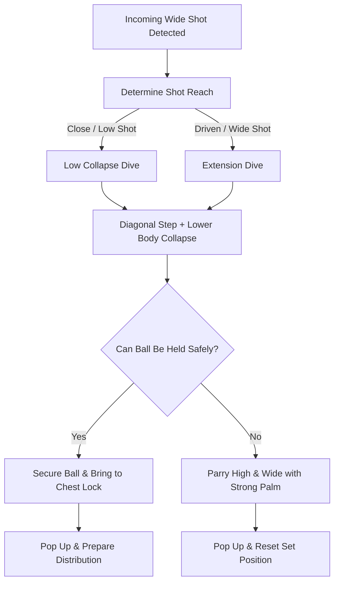

import { Card, CardGrid, Aside, Steps } from '@astrojs/starlight/components';

Transitioning to **9v9 play** on **6.5 × 18 ft goals** requires goalkeepers ages 9 to 12 (U10–U12) to cover significantly more net area. Teaching proper diving mechanics builds the physical confidence needed to stop shots driven wide while protecting the body from ground-impact injuries.

<Aside type="note" title="Grassroots Focus">
Fear of landing pain is the #1 barrier to diving. Never drill high extension dives on hard ground until low collapse landings are fully second nature.
</Aside>

---

## The 4 Pillars of Safe Diving

<CardGrid>
  <Card title="1. Diagonal Lead Step" icon="right-arrow">
    **"Step Cut the Angle"**
    
    Take a sharp diagonal step toward the path of the ball with the near foot. Stepping forward cuts down the shooter's angle and creates forward momentum.
  </Card>

  <Card title="2. Safe Landing Surface" icon="shield">
    **"Calf, Thigh, Lat"**
    
    Dissipate impact sequentially down the side of the body: outer calf, outer thigh, and lateral torso (latissimus dorsi). Never land on open elbows or hip bones.
  </Card>

  <Card title="3. Catch vs. Parry Choice" icon="random">
    **"Hold or Push Wide"**
    
    Secure clean catches with two hands behind the equator of the ball. On fast or unsavable shots, use firm palms to parry the ball high and wide toward the touchlines.
  </Card>

  <Card title="4. Dynamic Recovery" icon="refresh">
    **"Pop Up & Reset"**
    
    Use the non-landing leg to drive off the ground, bouncing back to a set stance immediately to handle second-shot rebounds.
  </Card>
</CardGrid>

---

## Diving Decision & Action Sequence

Goalkeepers process diving saves through a quick three-stage physical loop:

---

## Field-Ready Coaching Cues

Replace complex movement terms with simple, action-oriented field triggers:

| Technical Kinematics | Field Coaching Cue | Action Required |
| :--- | :--- | :--- |
| Power Step | **"Step & Drive!"** | Explode diagonally off the foot nearest to the ball path. |
| Ground Landing | **"Soft Side!"** | Absorb ground impact on muscular side surfaces, not joints. |
| Ball Security | **"Lock & Tock!"** | Pull caught ball directly to sternum upon landing. |
| Emergency Deflection | **"Strong Palms!"** | Drive open hand through lower half of ball toward corners. |
| Second Recovery | **"Pop Up!"** | Drive off top knee and hands to regain feet instantly. |

---

## Injury Prevention & Landing Safety

<Aside type="danger" title="Safety Warning: Protecting Joints and Ribs">
* **Elbow Injuries:** Landing on extended elbows transfers shot impact directly into shoulder and collarbone joints. Ensure arms extend *out* toward the ball path, not *under* the falling body.
* **Hip Bone Impact:** Landing flat on the side of the hip bone causes severe bruising. Ensure the keeper tilts forward slightly to land on the soft outer thigh.
* **Wrist Support:** Train keepers to keep wrists firm when parrying balls to prevent hyperextension or sprains.
</Aside>

---

## Field-Ready Session: Progression to Dynamic Diving (20 Mins)

Integrate diving mechanics into dynamic training patterns that move from low-impact landing drills to full-goal 9v9 shooting scenarios.

<Steps>
1. **Low Collapse Landing Warm-Up (5 Mins)**
   Goalkeeper starts in a kneeling position on soft grass. Coach serves low ground balls 2 yards wide. Keeper focuses on stepping the lead foot and sliding onto outer thigh and lat surface safely.

2. **Diagonal Step & Shot-Stopping (8 Mins)**
   Keeper starts in a set position on the goal line of a **6.5 × 18 ft goal**. Coach strikes ground shots and mid-height drives 3–4 yards wide. Keeper must execute a diagonal step (**"Step & Drive!"**), decide to catch or parry, and land cleanly.

3. **Rebound Recovery & Team Integration (7 Mins)**
   Position 2 attacking forwards at the edge of the 18-yard box. Coach strikes an initial wide shot forcing a diving save. As soon as the keeper parries or secures the ball, the coach feeds a second ball to a trailing forward. Keeper must **"Pop Up!"** and set for the second save.
</Steps>

<Aside type="tip" title="Coaching Tip">
Always evaluate diving performance on **approach footwork and landing surface safety** first. If a player makes a save but lands on their elbow, freeze the play and correct the landing surface before praising the save.
</Aside>