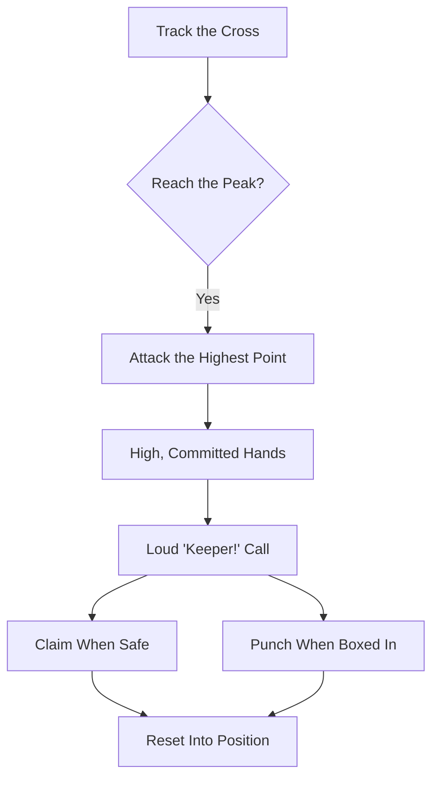

Attack crosses at the highest point, driving off one leg and catching with high, committed hands, claiming or punching with a loud call.

## [Cross Claiming](/reference-library/14-cross-collection/)

**Own the Center:** Attack crosses at the highest point, driving off one leg and catching with high, committed hands. Claim or punch with a loud "Keeper!" call.

## Claim vs Punch

**Read the Traffic:** [Claim](/reference-library/14-cross-collection/) when you can reach the peak ball cleanly; [punch](/reference-library/15-punching/) it to safety when you are boxed in or the contact is contested. A clean claim is better than a knocked-back punch.

