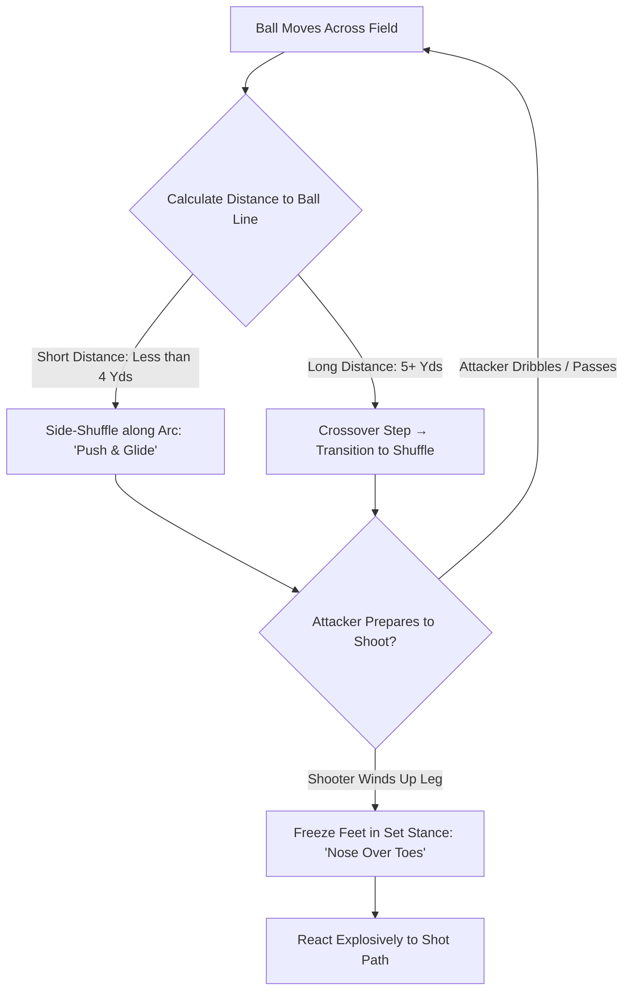

import { Card, CardGrid, Aside, Steps } from '@astrojs/starlight/components';

Transitioning to **9v9 play** introduces larger goals and expanded shooting angles. At ages 9 to 12 (U10–U12), a goalkeeper's primary shot-stopping foundation is proactive **footwork and positioning**. Arriving on the ball line and setting your stance *before* the shot is struck turns difficult diving saves into routine catches.

<Aside type="note" title="Grassroots Focus">
Footwork gets you into position; timing keeps you balanced. Teach young keepers to move **while the ball travels** and **freeze in a set stance** the moment the shooter prepares to strike.
</Aside>

---

## The 4 Pillars of Shot-Stopping Positioning

<CardGrid>
  <Card title="1. The Ball Line (Rope Geometry)" icon="compass">
    **"On the Line!"**
    
    Visualize an imaginary rope stretched from the center of the goal line directly to the ball. Always bisect the shooting angle by standing centered on this rope line.
  </Card>

  <Card title="2. The Arc & Side-Shuffle" icon="right-arrow">
    **"Push & Glide"**
    
    Move along a semi-circular arc 2 to 3 yards off the goal line. Use quick side-shuffles to stay centered on the ball without crossing your feet or clicking your heels.
  </Card>

  <Card title="3. Depth Adjustment for Shots" icon="up-arrow">
    **"Far Ball = Step Out, Near Ball = Drop"**
    
    When the ball is outside the 18-yard box, step out 3 to 4 yards to cut down the angle. As the ball enters the box, drop closer to your line (1 to 2 yards) to preserve reaction time.
  </Card>

  <Card title="4. Set Stance Readiness" icon="approve-check">
    **"Freeze on the Wind-Up!"**
    
    Stop all foot movement the instant the attacker raises their kicking leg. A static, balanced goalkeeper will react significantly faster than a goalkeeper caught mid-stride.
  </Card>
</CardGrid>

---

## Footwork Mechanics Breakdown

Choose the correct footwork technique based on the distance required to align with the ball:

### 1. The Side-Shuffle (Short Distances: 1 to 4 Yards)
* **When to Use:** Lateral ball movement across the box or small angle adjustments.
* **Key Mechanics:** Stay low in a athletic crouch. Push off the trailing foot and glide with the lead foot. **Never let your feet cross or touch.** Keep head level to maintain smooth visual tracking.

### 2. The Crossover Step (Long Distances: 5+ Yards)
* **When to Use:** Fast switch of play, wide cross-field passes, or recovery across the goal face.
* **Key Mechanics:** Turn hips and cross the back leg over the front leg for 1 to 2 explosive strides. Decelerate into a side-shuffle to square your shoulders to the ball before setting.

### 3. The Set Stance (Shot Readiness)
* **When to Use:** Executed immediately as the shooter prepares to strike the ball.
* **Key Mechanics:** Feet shoulder-width apart, knees flexed, weight balanced on the balls of your feet (heels slightly unweighted). Hands held at waist height, palms open and facing forward.

---

## Pre-Shot Footwork & Alignment Sequence

Goalkeepers process ball movement and adjust posture through a continuous footwork cycle:

---

## Landmark Positioning Guide for Shots

Use visual field landmarks to calibrate depth and angle without turning to look behind you:

| Ball Location | Recommended Keeper Position | Target Footwork & Stance |
| :--- | :--- | :--- |
| **Central Outside 18-Yard Box** | 3 to 4 yards off goal line (Bisecting center) | Light side-shuffle; high set stance ready for powered or lofted shots. |
| **Inside Penalty Box (Central)** | 1 to 2 yards off goal line | Micro-adjustments; narrow depth; low set stance to maximize reaction time. |
| **Wide Angle / Flank Attack** | 1 to 2 yards off near post line | Angle body 45° to ball; protect near post while keeping far post in field of view. |
| **Switch of Play (Far Flank)** | Shift along arc toward new ball line | Explosive **Crossover Step** → decelerate into **Side-Shuffle** → **Set Stance**. |

---

## Technical Coaching Warnings

<Aside type="caution" title="Common Youth Footwork Mistakes">
* **Hopping or Bouncing:** Jumping while shuffling leaves the goalkeeper airborne when the shot is taken, delaying reaction time. Keep feet close to the turf.
* **Flat-Footed Stance:** Sitting back on heels prevents explosive lateral diving. Ensure knees are flexed and weight is loaded onto the balls of the feet.
* **Moving During the Strike:** Taking a step while the attacker contacts the ball causes wrong-footing. Always **freeze in a set stance** on the striker's wind-up.
</Aside>

---

## Field-Ready Session: Footwork & Shot-Stopping Readiness (20 Mins)

Execute this practical training block to integrate clean footwork habits into shot-stopping.

<Steps>
1. **Arc Shuffle & Set Drill (5 Mins)**
   Set up 5 cones in an arc 3 yards off the goal line. Coach calls out cone numbers (1 to 5). Keeper executes rapid side-shuffles to align with the designated cone, landing in a loaded set stance within 2 seconds.

2. **Rapid Reaction: Shuffle vs. Crossover (7 Mins)**
   Two servers stand 18 yards out (one central, one wide). Server 1 plays a wide lateral pass to Server 2. Keeper uses an explosive **Crossover Step** to cover distance, transitions into a **Side-Shuffle**, and freezes in a set stance as Server 2 shoots.

3. **Game-Realistic Shot-Stopping Circuit (8 Mins)**
   Play 3v3 + GK in a 25 × 20 yard grid using a single goal. Outfield players are encouraged to shoot from all distances. Focus feedback strictly on the keeper's lateral footwork and static set stance before every shot.
</Steps>

<Aside type="tip" title="Coaching Tip">
Focus feedback on footwork *before* the shot, not just the save result. If a goal is conceded but the keeper executed a great shuffle and landed in a balanced set position, praise the pre-shot execution!
</Aside>