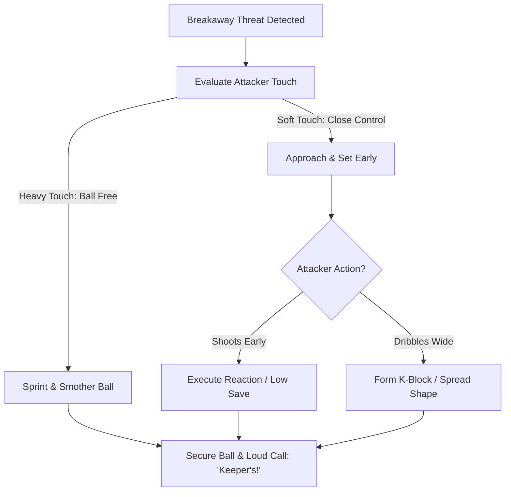

import { Card, CardGrid, Aside, Steps } from '@astrojs/starlight/components';

In a 1v1 breakaway, the goalkeeper must balance patience with decisive action. At ages 9 to 12 (U10–U12), the key is teaching players to **read the attacker's touch length** rather than blindly charging out or staying frozen on the goal line.

<Aside type="note" title="Grassroots Focus">
Patience is an active technique. Staying on your feet forces the attacker to make the first move, giving the keeper full control of the angle.
</Aside>

---

## The 4 Pillars of 1v1 Execution

<CardGrid>
  <Card title="1. Touch-Reading Cues" icon="magnifier">
    **"Heavy Touch = Attack"**
    
    If the ball rolls more than 2 yards away from the attacker, sprint out to smother it. If the ball stays close, hold your line and shorten your steps.
  </Card>

  <Card title="2. The Staggered Approach" icon="right-arrow">
    **"Match & Set"**
    
    Close space rapidly while the attacker looks down. The moment their head comes up to strike, freeze in a balanced set position 1–3 yards off your line.
  </Card>

  <Card title="3. The K-Block Shape" icon="shield">
    **"Make the Wall"**
    
    Drop one knee toward the heel of the opposite foot to close the 5-hole (nutmeg). Keep hands wide and low to block ground shots while keeping the chest upright.
  </Card>

  <Card title="4. Head & Core Protection" icon="warning">
    **"Protect the Head"**
    
    Never dive headfirst into an oncoming attacker's boots. Lead with hands and shoulders, keeping the chin tucked and core braced.
  </Card>
</CardGrid>

---

## 1v1 Decision & Action Sequence

Goalkeepers process 1v1 scenarios through a continuous evaluation loop:

---

## Field-Ready Coaching Cues

Translate complex tactical reading into instant verbal triggers on the field:

| Technical Concept | Field Coaching Cue | Action Required |
| :--- | :--- | :--- |
| Reading Space | **"Heavy Touch!"** | Explode off the line to win the loose ball. |
| Closing Speed | **"Match & Set!"** | Run fast when they look down; freeze when they look up. |
| Block Execution | **"Make the Wall!"** | Drop knee down, spread hands low, keep eyes on ball. |
| Defender Support | **"Force Outside!"** | Shout instructions to trailing recovery defenders. |
| Recovery Stance | **"Pop Up!"** | Bounce back to feet immediately if the shot is parried. |

---

## Safety & Collision Protocols

<Aside type="danger" title="Safety Warning: Avoiding Head & Joint Injuries">
* **Head Position:** Tuck the chin toward the collarbone when sliding into smothering saves to avoid accidental boot contact.
* **Low Hands:** Keep hands at or below knee height during block saves to prevent balls from slipping under the torso.
* **No Blind Charges:** Teach keepers never to slide feet-first toward an attacker, which leads to red-card fouls and severe leg injuries.
</Aside>

---

## Field-Ready Session: 1v1 Breakaway Integration (20 Mins)

Integrate this scenario-based drill block into team practices to simulate realistic breakaway pressure.

<Steps>
1. **Touch-Reading Reaction Warm-Up (5 Mins)**
   Coach passes balls from 18 yards out, alternating between heavy over-cooked passes and tight, short passes. Keeper must instantly read the speed and either charge to smother or set in position.

2. **1v1 Breakaway Duel with Recovery Defender (10 Mins)**
   Set up an attacker starting at midfield with a ball, tracked by a recovery defender starting 3 yards behind them. Attacker drives toward a **6.5 × 18 ft goal**. Keeper reads touch, closes angle, and makes decision while defender pressures back shoulder.

3. **Transition to Counter-Attack (5 Mins)**
   Upon making a save or smothering the ball, the keeper must immediately pop up and distribute via a slong throw or underhand bowl to a wide breakout target.
</Steps>

<Aside type="tip" title="Coaching Tip">
Praise goalkeepers for recognizing the correct moment to hold their ground, even if the attacker executes a great finish. Good decision-making is the priority over raw outcome.
</Aside>