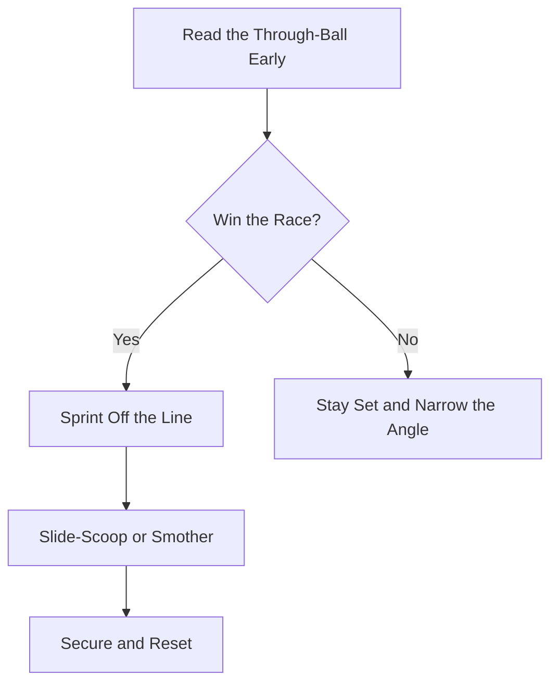

Read through-balls early and sprint off the line to slide-scoop or smother the loose ball before the attacker arrives.

## [Sweeping Through-Balls](/reference-library/20-sweeping/)

**First to the Ball:** Read through-balls early and sprint off the line to slide-scoop or smother the loose ball before the attacker arrives.

## When to Sweep

**Not Every Ball Is Yours:** Sweep with a clear run or a clear reach advantage. If the ball is already behind you or the attacker has a step, hold the line and prepare to save instead of chasing dead.

## Sweeping the Loose Ball

