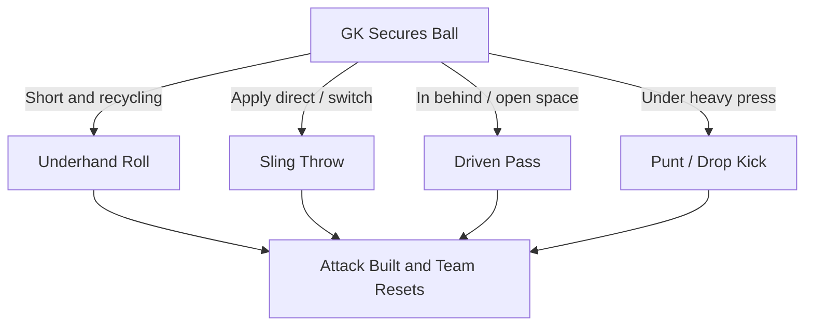

After every save the keeper restarts play. The young keeper learns to pick the right tool, roll, throw, drive, or punt, to turn defense into attack.

## Underhand Roll & Sling Throw

**Short Restart Tools:** Use an [underhand roll](/reference-library/21-bowling-distribution/) for accuracy and tempo; use the sling throw to launch the ball, skipping the midfield and catching the opposition out of shape.

## Driven Pass

**Find the Open Player:** A low driven distribution finds a spare attacker in stride and beats the press, opening up the pitch.

## Punt & Drop-Kick Clearance

**Clear the Danger:** When a press leaves no short option, the [punt](/reference-library/23-out-of-hands-punt/) clears the immediate danger zone and buys the team time to reset its shape.

## Distribution Decision Flow

