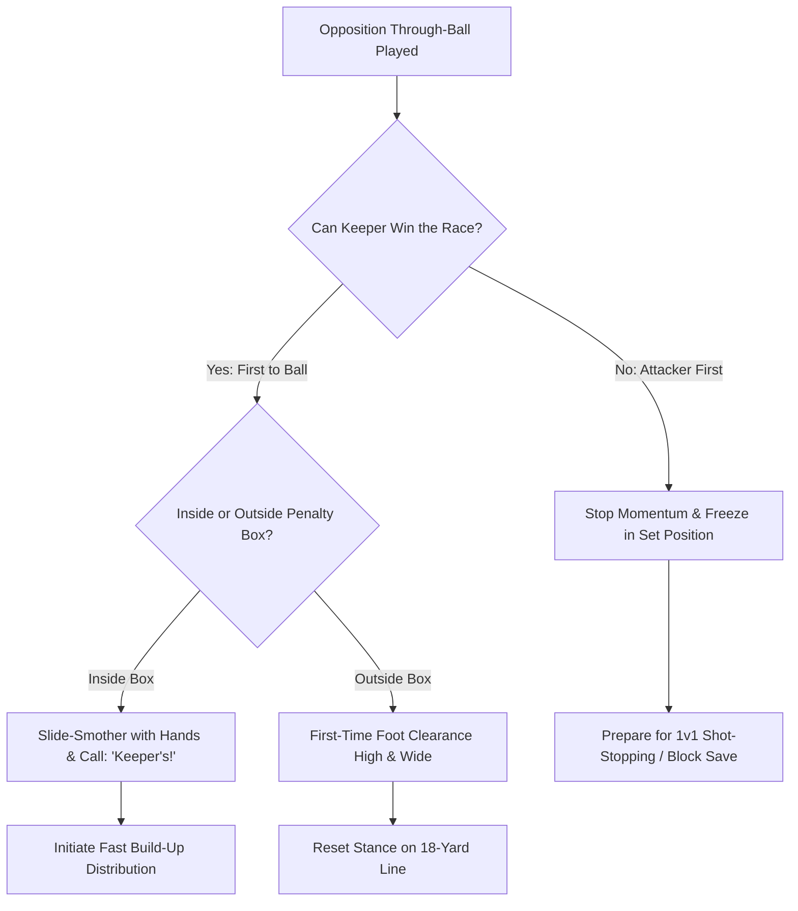

import { Card, CardGrid, Aside, Steps } from '@astrojs/starlight/components';

In **9v9 play**, the expanded field length creates space behind the defensive line for opposition through-balls. Goalkeepers must act as a **sweeper-keeper**, positioning themselves high off their goal line to intercept long passes before an attacker can shoot.

<Aside type="note" title="Grassroots Focus">
Sweeping is about speed of thought first, speed of foot second. Teaching players to start 5 to 8 yards off their line when the ball is in the middle third gives them the head start needed to win the race.
</Aside>

---

## The 4 Pillars of Sweeping Execution

<CardGrid>
  <Card title="1. High-Line Positioning" icon="right-arrow">
    **"Step Up with the Team"**
    
    When your team pushes up field, move to the edge of the 18-yard box. Maintain a 10-to-15 yard distance between yourself and your deepest defender.
  </Card>

  <Card title="2. The Box Boundary Rule" icon="warning">
    **"Inside = Hands, Outside = Feet"**
    
    Inside the penalty box, slide to smother or scoop with hands. Outside the penalty box, use a firm first-time foot clearance toward the touchlines.
  </Card>

  <Card title="3. Read the Weight of Pass" icon="magnifier">
    **"Heavy = Win It, Soft = Set"**
    
    If the through-ball is kicked too hard, sprint out to clear or smother. If the pass slows down near the attacker, stop and freeze in a shot-stopping set position.
  </Card>

  <Card title="4. Communication Calls" icon="comment">
    **"Keeper's!" / "Track Back!"**
    
    Shout a decisive call early. Tell your recovery defenders whether to leave the ball for you or turn and cover the open goal line.
  </Card>
</CardGrid>

---

## Sweeping Decision & Action Cycle

Goalkeepers process through-balls by evaluating pass weight and spatial boundaries:

---

## Field-Ready Coaching Cues

Replace theoretical concepts with immediate, single-word field triggers:

| Technical Concept | Field Coaching Cue | Action Required |
| :--- | :--- | :--- |
| Starting Position | **"Step Up!"** | Move 3-5 yards off line as team attacks middle third. |
| Race Decision | **"Race & Read!"** | Sprint the moment pass is struck; commit fully. |
| Outside Box Clearance | **"Drive it Wide!"** | Kicking first-time out of bounds to clear danger. |
| Inside Box Smother | **"Smother & Save!"** | Slide sideways with hands extended, wrapping body around ball. |
| Hesitation Trigger | **"Set & Hold!"** | Freeze on feet if attacker touches ball before you arrive. |

---

## Rules & Safety Protocols

<Aside type="danger" title="Safety & Boundary Rules">
* **No Hands Outside the Box:** Using hands outside the 18-yard penalty area results in an immediate handball foul and direct free kick. Teach keepers to recognize the penalty line visually.
* **Feet-First Tackling Hazards:** Avoid studs-up sliding into oncoming attackers. Outside the box, clear the ball cleanly with the instep or laces while keeping body orientation controlled.
* **Protecting the Head:** When sliding to smother inside the box, turn shoulders slightly and tuck the chin to protect against accidental boot contact.
</Aside>

---

## Field-Ready Session: Sweeper-Keeper Integration (20 Mins)

Integrate sweeping mechanics into high-line team defense scenarios.

<Steps>
1. **Pass Weight & Boundary Warm-Up (5 Mins)**
   Coach passes balls from 30 yards out into space, some rolling into the box, some stopping outside. Keeper starts high, reads the roll, and executes either a hand smother (inside) or foot clearance (outside).

2. **3v2 High-Line Counter Drill (10 Mins)**
   Set up 3 attackers vs. 2 defenders near midfield on a 9v9 pitch. Attackers play through-balls into the space behind defenders. Goalkeeper must read the pass, communicate loudly, and sweep loose balls or set for 1v1 saves.

3. **Transition to Counter-Attack (5 Mins)**
   Whenever the keeper sweeps or smothers a ball inside the box, they must immediately pop up and distribute via a thrown or kicked pass to a wide full-back initiating an attack.
</Steps>

<Aside type="tip" title="Coaching Tip">
Never scold a keeper for rushing out and getting beaten if their positioning was correct. Reward aggressive, proactive reading of space over passive line-standing.
</Aside>