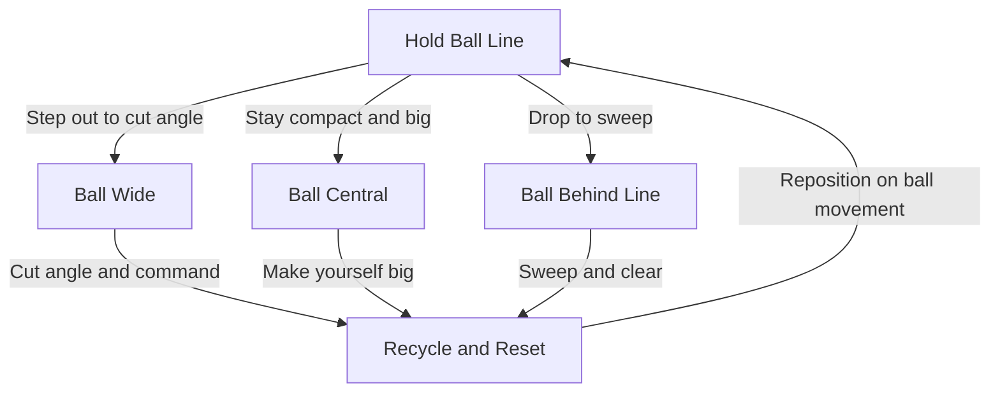

A great 9–12 keeper organizes their defense and holds a strong angle. Communication is the keeper's superpower at this stage.

## Angle & Ball-Line Play

**On the Angle, Stay Compact:** Hold the "ball line," the line from the center of goal to the ball, stepping out to cut the angle and away as the ball moves.

## Leading the Defensive Line

**Call the Shape:** Push and drop the back line with short calls like "up" and "drop" so the team moves as one. Set walls and mark for set pieces.

## Control the Line

**Cover the Last Line:** Read runs behind the defense and own the space between the box and the defensive line, sweep up through-balls before attackers can finish.

## Positioning Loop

