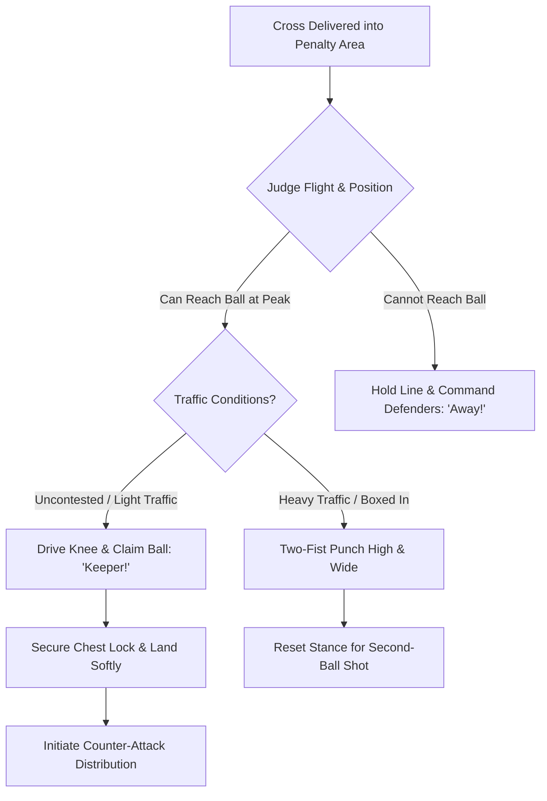

import { Card, CardGrid, Aside, Steps } from '@astrojs/starlight/components';

Transitioning to **9v9 play** introduces high floating crosses into an expanded penalty box with **6.5 × 18 ft goals**. At ages 9 to 12 (U10–U12), goalkeepers must learn to read ball flight paths, time their jump, and protect themselves during aerial traffic.

<Aside type="note" title="Grassroots Focus">
Depth perception in players under 12 is still maturing. Judge execution based on aggressive intent, early communication, and safe landing mechanics rather than perfect trajectory estimation.
</Aside>

---

## The 4 Pillars of Aerial Dominance

<CardGrid>
  <Card title="1. Knee-Drive Take-Off" icon="up-arrow">
    **"Drive the Knee!"**
    
    Plant the non-launch foot and drive the lead knee upward to 90 degrees. This provides height and creates a protective shield against incoming attackers.
  </Card>

  <Card title="2. High-Point Catch" icon="star">
    **"Catch at the Peak!"**
    
    Extend arms fully to secure the ball at the highest point of the jump before the body starts descending back to the ground.
  </Card>

  <Card title="3. Claim vs. Punch Decision" icon="random">
    **"Read the Traffic!"**
    
    Claim cleanly when unhindered at the peak; use a solid two-fist punch toward the sidelines when boxed in or under heavy physical contact.
  </Card>

  <Card title="4. Aerial Safety & Landing" icon="star">
    **"Land on Two Feet!"**
    
    Absorb impact by landing softly on both feet with knees flexed, pulling the ball tight into the chest lock immediately upon landing.
  </Card>
</CardGrid>

---

## Aerial Decision & Action Sequence

Goalkeepers process incoming crosses through a continuous evaluation loop:

---

## Field-Ready Coaching Cues

Replace theoretical concepts with immediate, action-oriented field triggers:

| Technical Concept | Field Coaching Cue | Action Required |
| :--- | :--- | :--- |
| Jump Elevation | **"Drive the Knee!"** | Explode off launch foot; lift non-launch knee up to waist height. |
| Catch Timing | **"Catch at the Peak!"** | Reach hands above head level before starting downward flight. |
| Tactical Decision | **"Keeper!" / "Away!"** | Call early and loudly before the ball enters the 6-yard area. |
| Punch Execution | **"Two Fists, High & Wide!"** | Drive both knuckles into lower half of ball toward touchlines. |
| Core Protection | **"Shield!"** | Keep raised knee locked in position until landing phase begins. |

---

## Safety & Collision Protocols

<Aside type="danger" title="Safety Warning: Preventing Collision & Fall Injuries">
* **No Single-Arm Punches:** Swinging with a single arm reduces control and increases risk of shoulder dislocation during air contact. Always punch with two fists joined together.
* **Knee-Shielding:** Never jump flat-footed or with both legs hanging straight down. The raised lead knee shields the chest and ribs from incoming collisions.
* **Protecting the Spine:** Never turn your back toward oncoming attackers while in mid-air. Keep eyes, chest, and hands facing outward toward the ball path.
</Aside>

---

## Field-Ready Session: Cross Defense & Transition (20 Mins)

Integrate aerial claiming into team cross-defense patterns rather than isolated static throwing drills.

<Steps>
1. **Uncontested Aerial Progression (5 Mins)**
   Coach serves lofted balls from wide areas. Keeper starts on line, reads flight, drives knee, calls **"Keeper!"**, catches at peak, and lands cleanly.

2. **Traffic & Pressure Drill (8 Mins)**
   Position 2 attackers and 2 defenders in the 6-yard box. Coach serves wide crosses. Keeper must decide to either command defenders (**"Away!"**) or drive through traffic to claim/punch (**"Keeper!"**).

3. **Cross Claim to Build-Up Transition (7 Mins)**
   Upon claiming a cross or punching wide, the keeper immediately initiates a counter-attack via an overhand side-arm throw to a wide full-back breaking past midfield.
</Steps>

<Aside type="tip" title="Coaching Tip">
If a keeper misjudges the flight of a floating cross, do not criticize the outcome. Ask them: *"Did you make your call early?"* and *"Did you drive your knee up?"* to reinforce proper habits.
</Aside>