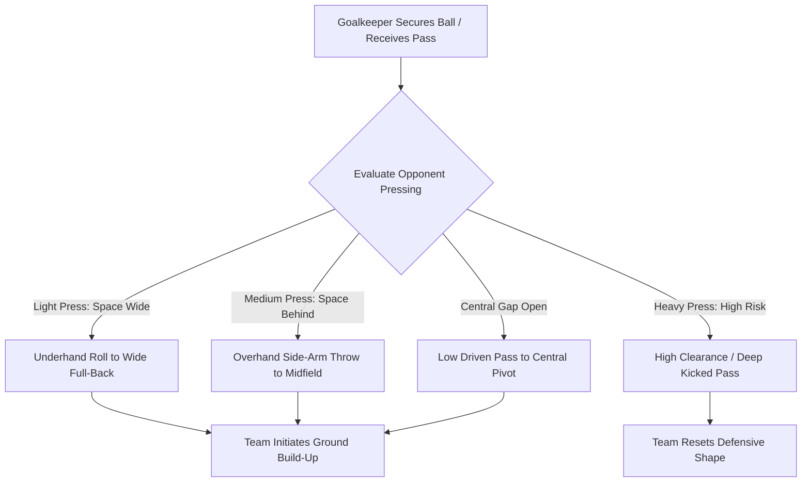

import { Card, CardGrid, Aside, Steps } from '@astrojs/starlight/components';

When a goalkeeper secures the ball, defense instantly turns into attack. In **9v9 play**, the goalkeeper functions as the **first attacker** (or 9th outfield player). Mastering short rolls, long throws, and low driven passes allows the team to play through opponent pressing and initiate fast counter-attacks.

<Aside type="note" title="Grassroots Focus">
Distribution is about target selection before technique. Teach goalkeepers to **scan the field before receiving** so they know their passing option before the ball arrives.
</Aside>

---

## The 4 Core Distribution Tools

<CardGrid>
  <Card title="1. Underhand Bowling Roll" icon="right-arrow">
    **"Low & Smooth"**
    
    Bend knees, step toward the target, and release the ball at ground level. Ideal for quick, accurate short passes to wide defenders to maintain possession tempo.
  </Card>

  <Card title="2. Overhand Side-Arm Throw" icon="rocket">
    **"Step & Launch"**
    
    Step with the non-throwing foot, bring the arm back in a wide arc, and release high to skip midfield lines and launch fast counter-attacks.
  </Card>

  <Card title="3. Low Driven Instep Pass" icon="approve-check">
    **"Lock Ankle, Punch Through"**
    
    Strike the center of the ball with locked ankle and firm follow-through. Used to clip ground passes directly into central midfielders or open attackers.
  </Card>

  <Card title="4. Out-of-Hands Clearance" icon="warning">
    **"High Clearance"**
    
    Drop and strike ball on the volley to clear heavy pressure when no short passing options exist. *(Check local league rules on punting restrictions).*
  </Card>
</CardGrid>

---

## Decision-Making Flowchart

Goalkeepers process distribution options by scanning opponent pressure and open teammates:

---

## Field-Ready Coaching Cues

Translate technical distribution biomechanics into simple, single-word field triggers:

| Technical Concept | Field Coaching Cue | Action Required |
| :--- | :--- | :--- |
| Hand Roll | **"Bowl It!"** | Get low, release at toe level, follow through along ground. |
| Long Throw | **"Launch!"** | Step with opposite foot, extend arm fully, throw with body weight. |
| Foot Pass | **"Lock Ankle!"** | Firm foot contact through center of ball, low follow-through. |
| Receiving Backpass | **"Open Up!"** | Receive on back foot to face the whole field before passing. |
| Scanning Field | **"Head Up!"** | Look up twice before dropping ball to feet or hands. |

---

## Tactical & League Rule Considerations

<Aside type="caution" title="Build-Out Line & Backpass Rules">
* **Backpass Rule:** Remind players that if a teammate deliberately kicks the ball back to the keeper, hands **cannot** be used. The keeper must control and pass with their feet.
* **Receiving Body Shape:** Teach keepers to stand at an angle on backpasses so a miskick rolls out for a corner kick rather than into the center of the net.
</Aside>

---

## Field-Ready Session: 9v9 Build-Up Integration (20 Mins)

Integrate goalkeeper distribution into team build-up patterns against realistic pressing.

<Steps>
1. **Target Selection Warm-Up (5 Mins)**
   Keeper stands in goal with 3 target gates (left, center, right) placed 15–20 yards out. Coach calls out a gate color right as keeper catches a served ball; keeper executes the correct throw or roll to that gate.

2. **Press-Breaking 4v2 Drill (10 Mins)**
   Set up a 30 × 25 yard grid using a **6.5 × 18 ft goal**. Goalkeeper + 3 defenders play out from the back against 2 pressing forwards. Defenders must split wide; keeper uses footwork or rolling distribution to beat the press and pass over the midfield line.

3. **Match-Realistic 9v9 Build-Out (5 Mins)**
   Full 9v9 scrimmaging phase where all restarts from the keeper must touch at least one defender's feet before crossing the halfway line.
</Steps>

<Aside type="tip" title="Coaching Tip">
Praise intention and decision quality over perfect execution. If a young keeper chooses the correct open player but misplaces the pass, validate the decision first before correcting footwork.
</Aside>