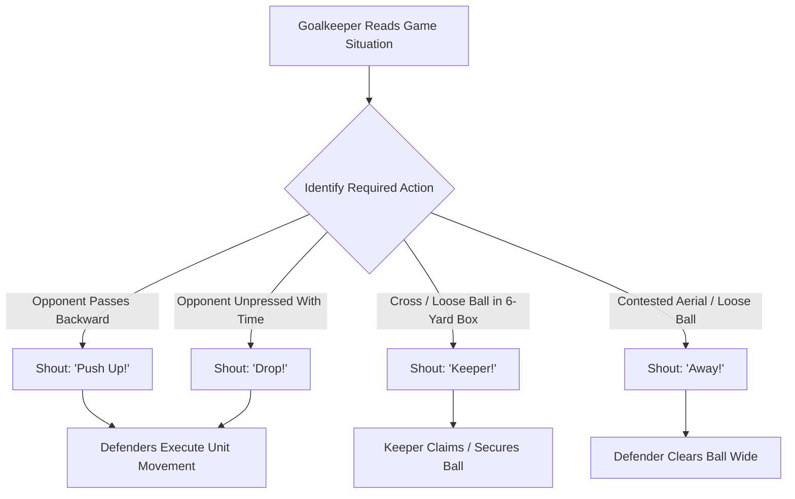

import { Card, CardGrid, Aside, Steps } from '@astrojs/starlight/components';

In **9v9 play**, the goalkeeper is the only player on the field who can see the entire game unfold. At ages 9 to 12 (U10–U12), **vocal communication** is an essential technical skill. Clear, authoritative calls organize defenders early, preventing opposition scoring opportunities before a shot even occurs.

<Aside type="note" title="Grassroots Focus">
Communication is a mechanical skill, not a personality trait. Teach young goalkeepers **short, single-word commands** delivered with high volume and clear intent.
</Aside>

---

## The 4 Pillars of Defensive Leadership

<CardGrid>
  <Card title="1. Short, Authoritative Calls" icon="comment">
    **"1 or 2 Words Maximum"**
    
    Avoid long sentences. Use clear, single-word triggers like **"Push!"**, **"Drop!"**, or **"Time!"** that defenders can instantly process and execute during fast play.
  </Card>

  <Card title="2. Steering the Defensive Line" icon="right-arrow">
    **"Command the Unit"**
    
    Act as the director of the back line. Push defenders up when the ball moves backward; drop them back when opposition midfielders have time to look up and pass.
  </Card>

  <Card title="3. Set-Piece Wall Building" icon="star">
    **"Sight the Post"**
    
    Organize 2-player or 3-player walls on direct free kicks. Stand at the near post, align the wall to cover the near-post angle, then step to your shot-stopping stance.
  </Card>

  <Card title="4. Claiming & Clearing Commands" icon="approve-check">
    **"Keeper!" vs. "Away!"**
    
    Make decisive calls early. Shout **"Keeper!"** when catching or smothering, or **"Away!"** to command defenders to head or kick dangerous loose balls out of the box.
  </Card>
</CardGrid>

---

## Vocal Decision & Leadership Loop

Goalkeepers continuously monitor game phase and defender positioning to issue clear field commands:

---

## Standardized Field Communication Cues

Equip keepers with standardized, single-word vocabulary for match situations:

| Match Situation | Field Cue | Expected Defender Action |
| :--- | :--- | :--- |
| **Opponent Plays Backward** | **"Push Up!"** | Back line steps up 5 to 10 yards as a single unit. |
| **Opponent Preparing Deep Pass** | **"Drop!"** | Defenders track backward to cover space behind the line. |
| **Defender Has Time on Ball** | **"Time!"** | Informs defender they are unpressed and can turn with the ball. |
| **Pressure Approaching Defender** | **"Man On!"** | Warns defender to play a fast 1-touch pass or reset to keeper. |
| **Goalkeeper Catching / Sweeping** | **"Keeper!"** | Authoritative command for defenders to clear out and protect keeper. |
| **Defender Must Clear Danger** | **"Away!"** | Commands defenders to head or kick the ball out of the penalty box. |

---

## Set-Piece Protocol: Wall Setup

Building a wall requires a structured, step-by-step routine to cover the near post on direct free kicks:

<Aside type="caution" title="Wall Size Rules (U10–U12)">
* **2-Player Wall:** Direct free kicks wide of the penalty box or further than 22 yards out.
* **3-Player Wall:** Direct free kicks central and within 18 yards of goal.
</Aside>

<Steps>
1. **Call Wall Count**
   Shout wall size immediately upon whistle (**"2 Players!"** or **"3 Players!"**).

2. **Sight from Near Post**
   Stand on the near goalpost. Look through the outside defender's hip to the ball, adjusting the wall until the near-post angle is fully covered.

3. **Shout Alignment Adjustments**
   Command wall position with loud cues: **"One Step Left!"** or **"Hold!"**.

4. **Reset Shot-Stopping Stance**
   Once aligned, sprint 2 to 3 steps toward the far-post area and freeze in a balanced set stance before the kick is taken.
</Steps>

---

## Field-Ready Session: Vocal Steering & Wall Organization (20 Mins)

Integrate defensive communication drills into team defensive shape practices.

<Steps>
1. **Command Cue Reaction Drill (5 Mins)**
   Defenders line up on the 18-yard box facing away from goal. The coach holds up visual color cards; the keeper reads the card and shouts the corresponding command (**"Push!"**, **"Drop!"**, **"Man On!"**). Defenders must instantly react to the call.

2. **Rapid Wall Setup Drill (7 Mins)**
   Coach awards free kicks at random spots 15–20 yards out. The keeper has 5 seconds to yell the wall count (**"3 Players!"**), align the wall from the near post, retreat to their far-post set stance, and prepare for the strike.

3. **Phase of Play: 5v4 Line Steering (8 Mins)**
   Play 5 attackers vs. 4 defenders + GK starting from midfield. The goalkeeper must vocally steer the back line, call out unmarked attackers (**"Mark Up!"**), and decisively command loose balls (**"Keeper!"** / **"Away!"**).
</Steps>

<Aside type="tip" title="Coaching Tip">
Praise volume, timing, and confidence. If a keeper makes a loud call that turns out to be tactically incorrect, praise the leadership volume first, then refine the tactical decision during the natural break in play.
</Aside>