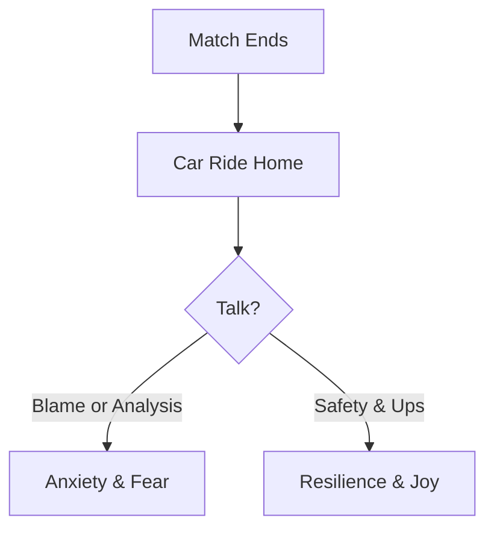

Conceding a goal sits squarely on one pair of shoulders, and a young keeper carries that weight long after the final words have faded.

## Unconditional Emotional Safety

The post-match role is to provide an anchor, not analysis. Frame conceding a goal as a milestone to learn from, not a judgment on the child.

## Coaching the Parents

When we coach parents alongside players, we help families celebrate the high points and process the lows without losing love for the game.

## The Post-Match Loop

