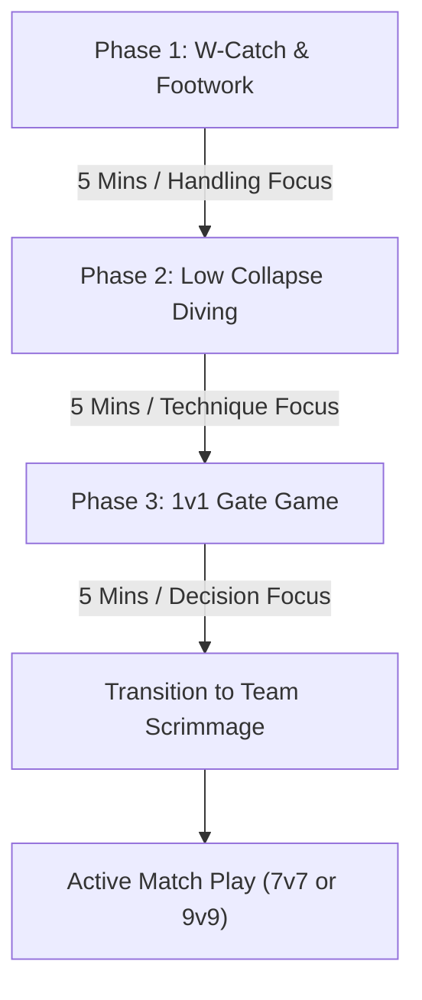

import { Card, CardGrid, Aside, Steps } from '@astrojs/starlight/components';

A high-efficiency **15-minute keeper warm-up block** designed to fit seamlessly inside team practices. Every drill starts with handling or footwork and ends with an active distribution (throw, bowl, or kick) so habits stay directly connected to game play.

<Aside type="note" title="Grassroots Practice Design">
Never isolate goalkeepers for an entire 90-minute session. Run this 15-minute block during team warm-ups using field players as servers, then integrate keepers directly into small-sided possession games.
</Aside>

---

## 15-Minute Session Architecture

<CardGrid>
  <Card title="Phase 1: Handling & Footwork" icon="compass">
    **5 Minutes**
    
    High-repetition W-catch handling, arc shuffling, and secure chest-locking with a field player partner.
  </Card>

  <Card title="Phase 2: Safe Collapse Diving" icon="down-arrow">
    **5 Minutes**
    
    Low-impact side-contour landings on soft turf. Focuses on proper deceleration and protecting hips and elbows.
  </Card>

  <Card title="Phase 3: 1v1 Decision Games" icon="shield">
    **5 Minutes**
    
    Gamified 1v1 gate attacks applying set timing, K-block spread saves, and immediate counter-distribution.
  </Card>
</CardGrid>

---

## Session Workflow Diagram



---

## Phase 1: W-Shape Catch & Arc Footwork (5 Mins)

**Objective:** Build clean catching habits and set-position readiness using outfield teammates as servers.

### Setup & Organization
* Partners stand **8 yards apart** with 1 ball.
* Goalkeeper starts in an athletic set stance on an imaginary arc line.

<Steps>
1. **Server Feed**
   The outfield teammate feeds firm, chest-height passes.

2. **Attack the Ball**
   The goalkeeper steps forward onto the ball line, shouting an authoritative **"Keeper's!"** call.

3. **Form the W-Shape**
   Catch the ball using the W-hand position (thumbs almost touching, index fingers forming the top of the W).

4. **Secure to Chest Lock**
   Instantly pull the ball into the chest cavity, wrapping both forearms tightly around it.

5. **Return Distribution**
   Bowl or underhand sling the ball back to the partner's feet to reset.
</Steps>

<Aside type="tip" title="Coaching Cue">
**"See the Ball Through the W!"** If the keeper's thumbs are too far apart, firm shots will pop through their hands and hit them in the face.
</Aside>

---

## Phase 2: Safe Side-Contour Collapse Diving (5 Mins)

**Objective:** Teach low-impact landing mechanics to prevent fear of ground contact on low shots.

<Aside type="caution" title="Safety First: Impact Protection">
Never let young goalkeepers land directly on their elbows, wrist joints, or hip bones! Landings must occur sequentially along the fleshy side of the body: **Outer Calf → Outer Thigh → Lateral Torso**.
</Aside>

### Step-by-Step Mechanical Progression

<Steps>
1. **Seated / Kneeling Progression (1 Min)**
   Start sitting or kneeling on soft grass. Partner rolls the ball 2 yards to the side. Keeper reaches with both hands behind the ball, collapsing onto their side.

2. **Lead Step & Collapse (2 Mins)**
   From a low set stance, the keeper takes a small lateral lead step toward the rolling ball, lowers their center of gravity, and glides onto their side.

3. **Top Hand Security (2 Mins)**
   Ensure the bottom hand is behind the ball (stopping forward momentum) and the top hand secures the top of the ball (pinning it to the turf).
</Steps>

---

## Phase 3: 1v1 Gate Game & Distribution (5 Mins)

**Objective:** Develop patience in 1v1 duals, teach the K-Block spread stance, and enforce fast counter-attacks.

```
[ 4-Yard Gate ]
      GK1
      |
      | 12-Yard Neutral Zone
      |
      GK2
[ 4-Yard Gate ]
```

### Game Rules
* Two 4-yard cone gates placed **12 yards apart**.
* **GK1** acts as the attacker dribbling toward the opposite gate; **GK2** acts as the defender protecting their line.
* Attacker must try to dribble through or shoot past the keeper within 5 seconds.
* Defender delays their slide, stays on their feet as long as possible (**"Stay Big, Stay Late"**), and drops into a **K-Block Spread** if the attacker strikes close-range.
* **Immediate Reset:** Upon making a save or claim, the defender must instantly bowl or sling the ball into a small target goal or to a teammate to score 1 bonus point.

---

## Team Session Integration Bridge

Once the 15-minute keeper block is complete, immediately transition the goalkeepers into team practice. Use this reference matrix to maintain goalkeeper engagement:

| Team Practice Activity | Traditional Problem | Correct Keeper Integration |
| :--- | :--- | :--- |
| **Possession Grid (4v4 / 5v5)** | Keepers used as static neutral wall players who only use their feet. | Keepers play inside the grid using hands for targeted distribution when back-passed to. |
| **Small-Sided Game (4v4 + GKs)** | Keepers stand idle while outfield players shoot from random angles. | Restrict outfield players to maximum 3 touches to force more quick shots and dynamic saves. |
| **Full Match Phase (9v9)** | Keepers ignored during tactical stoppages. | Freeze play during defensive line shifts to coach goalkeeper positioning on the ball line. |

---

<Aside type="tip" title="Psychological Resilience Tip">
When a goalkeeper concedes a goal during the 15-minute block or subsequent team scrimmage, evaluate the **decision**, not just the outcome. Validate aggressive positioning and loud communication even if the physical save was missed.
</Aside>