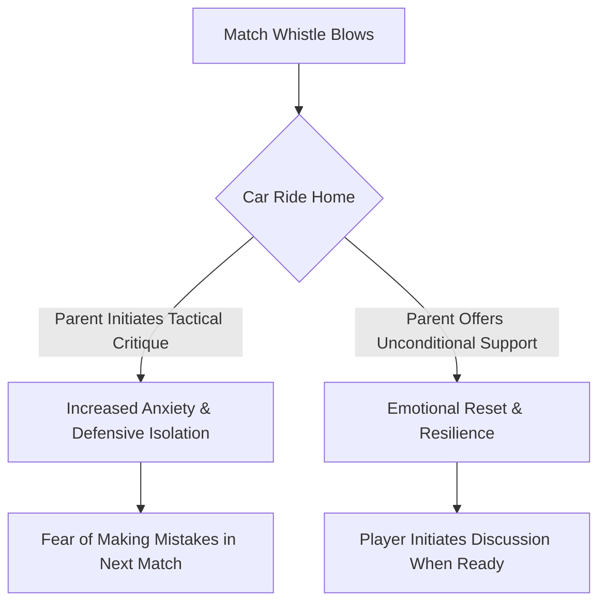

import { Card, CardGrid, Aside, Steps } from '@astrojs/starlight/components';

Conceding a goal sits squarely on one pair of shoulders. At ages 9 to 12 (U10–U12), a young goalkeeper carries that emotional weight long after the final whistle. The parent's primary role is to act as an emotional anchor, providing unconditional support regardless of match outcomes.

<Aside type="note" title="Grassroots Parenting Philosophy">
Parents are a goalkeeper's emotional safe harbor, not their technical analyst. Leave tactical debriefs to the coach and focus on building long-term resilience and love for the game.
</Aside>

---

## The 4 Pillars of Goalkeeper Parenting

<CardGrid>
  <Card title="1. The Decompression Zone" icon="heart">
    **"I Loved Watching You Play"**
    
    Transform the car ride home into an unconditional safe space. Avoid offering unsolicited coaching advice, critiquing mistakes, or analyzing conceded goals.
  </Card>

  <Card title="2. The 24-Hour Rule" icon="star">
    **"Pause Before Processing"**
    
    Wait 24 hours before discussing match performance. Immediate post-match emotions block constructive reflection; time restores perspective and calm.
  </Card>

  <Card title="3. Identity Protection" icon="star">
    **"Separating Person from Performance"**
    
    Help young players understand that a conceded goal is something that happened in a game, not a reflection of who they are as a person.
  </Card>

  <Card title="4. Sideline Shielding" icon="star">
    **"Positive Sideline Energy"**
    
    Protect your keeper from adult sideline anxiety. Refrain from shouting instructions, groaning at mistakes, or reacting visibly to conceded goals.
  </Card>
</CardGrid>

---

## The Post-Match Decompression Flow

Parents guide their child's emotional recovery using a intentional communication loop:

---

## Communication Guide: What to Say vs. What NOT to Say

Equip parents with actionable phrasing to navigate tough post-match moments:

| Match Situation | Avoid Saying (High Pressure) | Try Saying (High Support) |
| :--- | :--- | :--- |
| **After Conceding a Soft Goal** | "Why didn't you catch that ball?" | "I love watching you play and compete out there." |
| **After a High-Score Loss** | "Your defenders left you totally exposed." | "Tough game today! Where should we grab lunch?" |
| **Player Is Upset in the Car** | "It's just a game, don't worry about it." | "I can see you're frustrated. I'm here if you want to talk." |
| **Player Asks for Feedback** | "You need to work on your diving mechanics." | "What felt good out there, and what do you want to ask Coach about next practice?" |

---

## The 4-Step Post-Match Decompression Routine

Guide parents through a structured post-game transition from pitch to home:

<Steps>
1. **The Pitch-Side Greeting (First 2 Minutes)**
   Offer a warm hug, a fresh water bottle, and a smile. Avoid asking "What happened on that third goal?"

2. **The Car Ride Home (Next 20 Minutes)**
   Let the player lead the conversation. If they want to listen to music or sit in silence, respect their processing style.

3. **The Evening Reset (Post-Game)**
   Shift focus entirely away from soccer. Engage in non-sport family activities to reinforce that family life is stable regardless of wins or losses.

4. **The Next-Day Check-In (24 Hours Later)**
   If the player brings up match errors the following day, listen actively and encourage them to formulate a question for their coach at the next session.
</Steps>

---

## Parent-Coach Alignment Charter

<Aside type="tip" title="Coach-Parent Communication Protocol">
Coaches and parents must work as a unified team to protect the young goalkeeper's psychological wellbeing:
* **Direct All Technical Questions to Coaches:** Parents should never instruct goalkeepers on technique, line depth, or positioning.
* **Observe Training Sessions Quietly:** Give goalkeepers space to make errors and learn during practices without parent intervention.
* **Report Overwhelming Anxiety Early:** If a young keeper exhibits severe pre-match anxiety, parents should notify the head coach privately to adjust competition volume.
</Aside>

<Aside type="caution" title="Red Flag Warning Signs">
If a U10–U12 goalkeeper shows these behaviors, pause competitive pressure immediately:
* Feigning injury or illness before matches to avoid playing in goal.
* Visibly crying or freezing on the field after conceding a single goal.
* Expressing feelings of letting down the entire team or family after a loss.
</Aside>