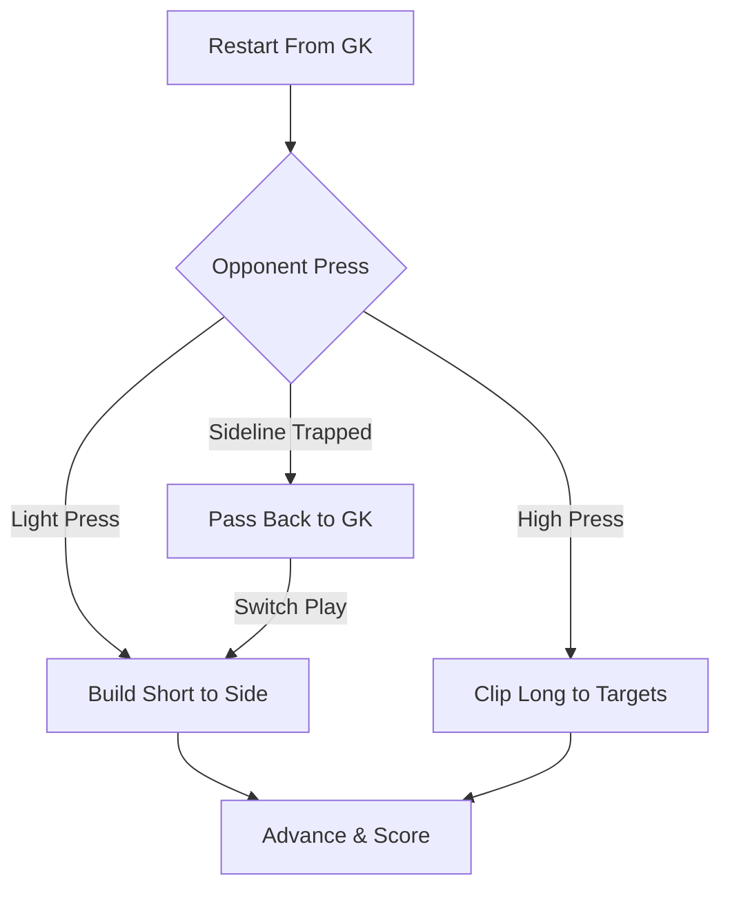

import { Card, CardGrid, Aside, Steps } from '@astrojs/starlight/components';

Make every restart start from the goalkeeper's hands or feet. This transforms the keeper into a primary distribution playmaker rather than a passive shot-stopper sitting on the goal line.

<Aside type="tip" title="The Back-Door Escape">
Teach outfield players that the goalkeeper is always an open passing option. Playing backward to the keeper is not a retreat, it is a tactical reset to attack the weak side of the opponent's press.
</Aside>

---

## Game Setup & Format

Adapt field space to match your age group's physical pass range.

<CardGrid grid={2}>
  <Card title="7v7 Format (U8–U10)" icon="star">
    * **Grid Size:** 35 × 25 yd (Build-Up Line active)
    * **Structure:** 4v3 + GK in build-up zone
    * **Primary Focus:** Hand distribution (bowling/rolling) or goal kicks to wide defenders on the touchline.
  </Card>

  <Card title="9v9 / 11v11 Format (U11+)" icon="rocket">
    * **Grid Size:** Half Pitch
    * **Structure:** 6v5 + GK (or 8v7 + GK)
    * **Primary Focus:** First-touch directional control, playing off the back foot, and switching play under pressure.
  </Card>
</CardGrid>

---

## Core Operational Rules

<Steps>
1. **Universal Restart Trigger:** All ball restarts (out of bounds, catches, conceded goals) originate from the goalkeeper's gloves or 6-yard box.

2. **Open the Field Rule:** Center-backs and fullbacks must touch the outer sidelines immediately when the keeper secures the ball to create maximum width.

3. **Back-Foot Safety Cue:** Back-passes must be directed **outside the goal frame** (toward the goal posts, never straight at the center of the net) so a bobble or miss does not result in an own-goal.

4. **Vocal Command Requirement:** The goalkeeper must call *"My Ball!"* or *"Ball to Feet!"* before receiving a back-pass.
</Steps>

---

## Technical & Tactical Execution

<Aside type="caution" title="Safety Zone Rule">
Never allow a goalkeeper to receive a back-pass inside their own 6-yard box while facing their own goal. The keeper must step to the side of the post and open their hips to the entire pitch.
</Aside>

---

## Session Progressions

Scale decision difficulty gradually to preserve player confidence while increasing tactical challenge.

<Steps>
1. **Level 1: Passive Pressure (Shadow Press)**
   Attacking defenders must stay behind the build-up line until the goalkeeper completes the initial pass. Focus on clean technique and accurate distribution.

2. **Level 2: Active Pressing**
   Allow 2 attackers to press high as soon as the goalkeeper places the ball down or releases a throw.

3. **Level 3: Game Realism & Scoring Bonus**
   * **Distribution Bonus:** Earn 2 points if a team completes 4 passes starting from the keeper and scores.
   * **Touch Constraints:** Limit outfield defenders to 2 touches during the build-up to force quicker decision-making.
</Steps>

---

## Psychological Resilience: Handling Distribution Errors

When a keeper turns over a ball during build-up play:

* **Coach Reaction:** Freeze the play, reinforce the *correct tactical choice* over the physical error, and restart from the keeper immediately.
* **Team Cue:** Outfield players must offer immediate verbal support (*"Right idea, reset!"*) to prevent the keeper from playing scared on the next repetition.