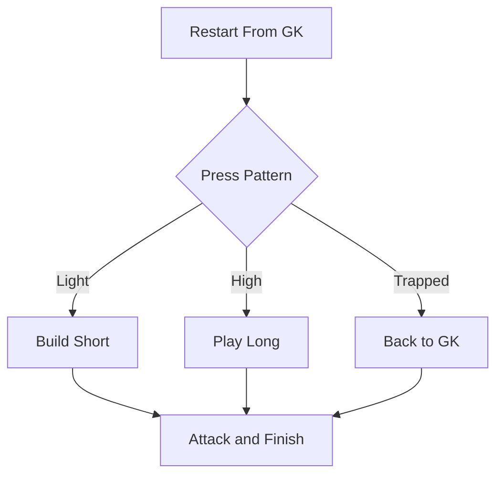

The single best way to integrate a goalkeeper into team practice: make every restart start from the gloves. The keeper becomes a real playmaker, not a target.

## Setup

**8v8, Two Goals:** Half a pitch, two full goals with keepers. All goal kicks, back passes, and catches restart from the GK.

## The Rule

**Every Attack Starts With the GK:** The keeper chooses short to a center back or fullback, or long to a forward. Outfield players must create width and depth to give two clear options.

## Use the GK as the Relief Valve

**Recycle Back:** If the press traps the build-up, players play back to the GK, who resets the attack. Under pressure the keeper stays a safe option, never a liability.

## Add Conditions

**Progress It:** Start unrestricted. Then add: 6 passes before a shot scores double, or a two-touch limit for the backline. Raise the press gradually so decisions get harder, not easier.

