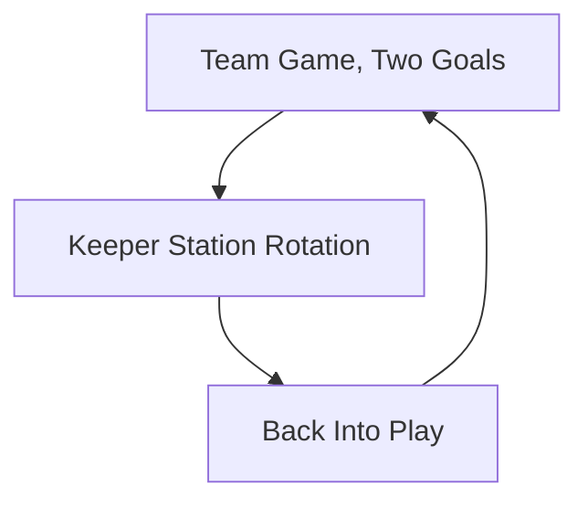

import { Aside } from '@astrojs/starlight/components';

Goalkeepers train twice as hard when they never stop playing. Weave keeper stations into the team rotation so the goalkeeper stays part of the squad, not parked at a goal.

## Two Goals, Two Keepers

**No Idle Gloves:** Always run games with two goals so both keepers work. If you only have one goal, rotate the spare keeper into outfield play.

## Keeper Station Rotation

**10 Minutes of Stations:** Set up a keeper circuit (scoop, W-catch, footwork) beside the main game. Players rotate through so outfielders get a taste and keepers stay in the warm-up.

## Serve From the GK

**Finishing Starts With the Keeper:** In every shooting and crossing game, the ball starts from the goalkeeper's hands. Distribution reps happen automatically.

<Aside type="caution" title="Rule of Thumb">
  **Time in Goal ≠ Training:** Standing in goal during a team drill is not practice. If the keeper gets fewer touches than the worst outfield player, the session is a failure, not the keeper.
</Aside>

