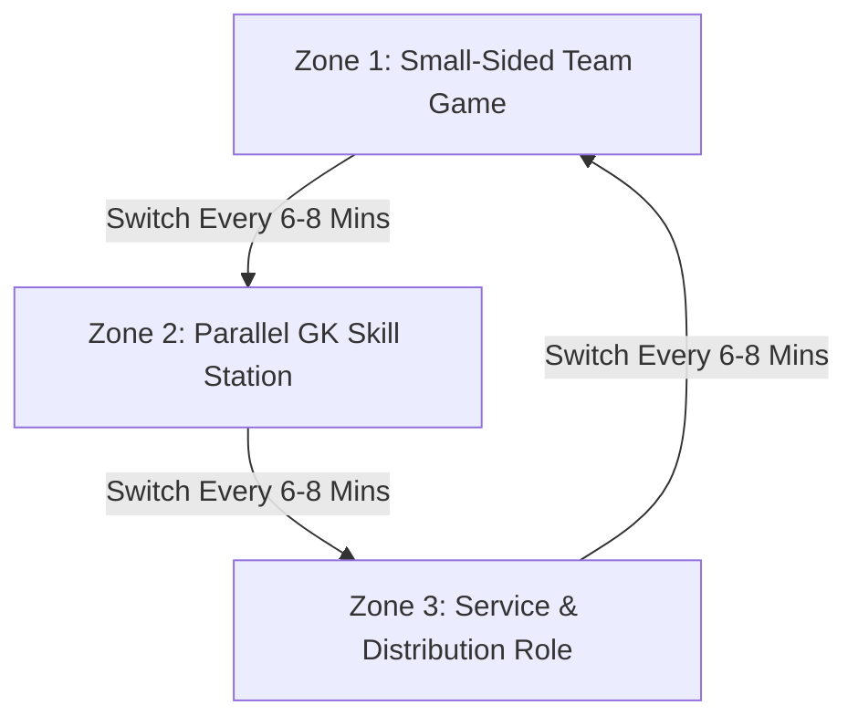

import { Card, CardGrid, Aside, Steps } from '@astrojs/starlight/components';

Goalkeepers develop twice as fast when they remain active participants throughout team practice. Integrating goalkeeper-specific stations directly into team rotations eliminates standing idle and builds well-rounded footballers.

<Aside type="caution" title="The 100-Touch Benchmark">
Standing in net while outfield players shoot from 30 yards out is not goalkeeper training. If your goalkeeper touches the ball fewer times than an outfield player during a session, restructure your field organization immediately.
</Aside>

---

## Core Integration Strategies

Implement these structural rules to maximize active repetitions for all goalkeepers on your roster.

<CardGrid grid={2}>
  <Card title="Two Goals, Zero Idle Time" icon="star">
    * Run small-sided games using two goals so both goalkeepers receive continuous match reps.
    * If only one goal is available, alternate keepers every 3 minutes or rotate the resting keeper as a neutral outfield playmaker.
  </Card>

  <Card title="The Parallel Skill Circuit" icon="right-arrow">
    * Set up a 10 × 10 yd technical station directly alongside the main team field.
    * Pair one goalkeeper with 2–3 outfield players to cycle through high-repetition catching, footwork, and distribution drills.
  </Card>

  <Card title="Distribution Starts Every Drill" icon="rocket">
    * Every shooting, crossing, or possession exercise must initiate from the goalkeeper's gloves or feet.
    * This doubles distribution repetitions without adding extra drill time to your practice plan.
  </Card>

  <Card title="Outfield Player Exposure" icon="star">
    * At U6–U10 levels, rotate outfield players into keeper station drills to build handling confidence and reduce fear of the ball.
  </Card>
</CardGrid>

---

## The 3-Zone Station Rotation Flow

Structure your field grid so goalkeepers transition seamlessly between dedicated technical work and small-sided team play.

---

## Setup Guide: 10-Minute Parallel Keeper Station

Run this high-repetition circuit directly adjacent to your team's small-sided game pitch.

<Steps>
1. **Grid Setup:** Define a 10 × 10 yd box using 4 flat cones, placed 5 yards away from the sideline of the main pitch.

2. **Station Pairing:** 1 Goalkeeper + 2 Outfield Feeders (or 2 Goalkeepers taking turns serving).

3. **Technique 1: Contour & W-Catch (2 Mins)**
   Feeder underhand tosses balls to eye level. Keeper catches using proper W-hand formation (thumbs almost touching, wrists firm).

4. **Technique 2: Low Scoop & Shuffle (2 Mins)**
   Feeder plays firm ground passes. Keeper shuffles laterally, gets chest behind the ball, and uses a pinkies-together scoop catch.

5. **Technique 3: Dynamic Distribution (2 Mins)**
   Keeper receives a back-pass on their back foot, opens their hips, and delivers a targeted side-arm bowl or lofted pass to a target cone.

6. **Rotation Trigger:** Swap the goalkeeper back into the main team game and send the next player into the station.
</Steps>

---

## Technical Cues for Non-Specialist Coaches

Use these simple coaching phrases to ensure correct execution during station work:

<Aside type="tip" title="Field Coaching Cues">
* **"Thumbs Together for High Balls":** Creates the W-catch barrier so the ball cannot slip through to the face or chest.
* **"Pinkies Together for Low Balls":** Forms a natural basket to catch low shots and ground passes securely.
* **"Set Before the Strike":** Feet shoulder-width apart, knees flexed, weight on the balls of the feet before the shooter connects with the ball.
</Aside>

---

## Session Structure Checklist

Use this 60-minute framework to keep your goalkeepers continuously engaged:

| Phase | Time Block | Goalkeeper Action | Outfield Integration |
| :--- | :--- | :--- | :--- |
| **Warm-Up** | 00–12 min | Dynamic movement, hand-eye coordination tosses | Integrated into team footwork and agility ladders. |
| **Skill Station** | 12–32 min | 10-minute parallel circuit (W-catch, scoop, distribution) | Rotates with 2 outfield players serving and learning mechanics. |
| **Game Application** | 32–52 min | Small-sided match play (7v7 or 9v9) | Full team match; all restarts initiate through the goalkeeper. |
| **Cool-Down** | 52–60 min | Light stretching, mental reset protocol | Team debrief on build-up success and defensive organization. |