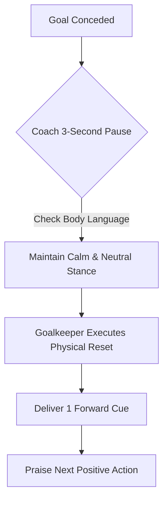

import { Card, CardGrid, Aside, Steps } from '@astrojs/starlight/components';

The moments directly following a conceded goal determine whether a young goalkeeper stays mentally engaged or shuts down. Establishing a predictable physical ritual transforms emotional distress into a calm, focused restart.

<Aside type="caution" title="The 3-Second Coach Rule">
Do not deliver tactical instructions immediately after a goal is conceded. Allow your goalkeeper to execute their physical reset routine first. Coaches must mirror calm, neutral body language, emotional reactions from the bench amplify player panic.
</Aside>

---

## The 4-Step Physical Reset Routine

Teach your goalkeeper to perform this 10-second physical anchor routine after every ball enters the net.

<Steps>
1. **Retrieve & Release:** Pick up the ball from the net calmly. Turn toward the endline, take one deep belly breath, and drop the ball outside the penalty box.

2. **Physical Anchor:** Wipe hands on shorts or tap both goalposts with your gloves. This physical touch signals the end of the previous play.

3. **Verbal Reset Cue:** Speak a single forward-focused phrase out loud: *"Fresh clock, next action."*

4. **Claim Your Line:** Step back onto the center of the goal line, drop into a balanced set position, and call out your first defensive direction to the team.
</Steps>

---

## Developmental Adaptations by Age Group

Psychological regulation evolves as players mature physically and cognitive load capacities increase.

<CardGrid grid={2}>
  <Card title="Grassroots (U8–U10) → External Reassurance" icon="star">
    * **Focus:** Emotional safety and fear reduction.
    * **Coach Role:** Provide immediate positive validation regardless of the error (*"Unlucky, Sam! Great dive, next play!"*).
    * **Keep it Simple:** Focus solely on getting back to the set position without over-analyzing mechanics during match play.
  </Card>

  <Card title="Youth Elite (U12–U14) → Tactical Ownership" icon="rocket">
    * **Focus:** Re-establishing command and organizing the defensive line.
    * **Keeper Role:** Direct outfield defenders immediately after the reset (e.g., *"Push the line to the 18!"*).
    * **Mindset Shift:** Shift focus outward onto tactical organization to replace internal self-blame.
  </Card>
</CardGrid>

---

## Eliminating Teammate Scapegoating

A conceded goal is always a team breakdown, never an isolated goalkeeper failure.

<Aside type="danger" title="The Zero-Blame Teammate Rule">
Enforce a strict team policy: No outfield player may show negative body language (throwing hands up, head dropping) or blame the goalkeeper after a goal.

* **Mandatory Action:** The nearest defender must walk to the goalkeeper, offer a fist bump, and say: *"We get it back together."*
* **Coach Intervention:** Immediately sub off any outfield player who publicly scolds the goalkeeper on the field.
</Aside>

---

## Coaching Actions: Managing the Game Flow

Follow these practical guidelines from the bench to protect your goalkeeper's long-term confidence.

<CardGrid grid={2}>
  <Card title="Deliver One Forward Cue" icon="compass">
    Avoid long explanations on the sideline. Use short, actionable phrases during play:
    * *"Good angle, reset your shape!"*
    * *"Eyes forward, clear mind!"*
  </Card>

  <Card title="Reward the Response" icon="shield">
    Actively praise the goalkeeper's **first successful action** after a mistake (a clean catch, accurate pass, or vocal call). This rewires their memory so the sequence ends on a success.
  </Card>
</CardGrid>

---

## Post-Game Debrief Framework

Never analyze conceded goals on the field immediately after the final whistle. Save video analysis or tactical adjustments for the next scheduled training session.

| Timeframe | Coach Action | Focus Area |
| :--- | :--- | :--- |
| **Immediate Post-Match** | High-fives & positive team reinforcement | Emotional recovery & collective effort |
| **Next Practice (Warm-Up)** | 1-on-1 private check-in with goalkeeper | Revisit feelings & highlight positive saves |
| **Next Practice (Main Drill)** | Recreate the scenario in a supportive drill | Re-teach technical mechanics without pressure |