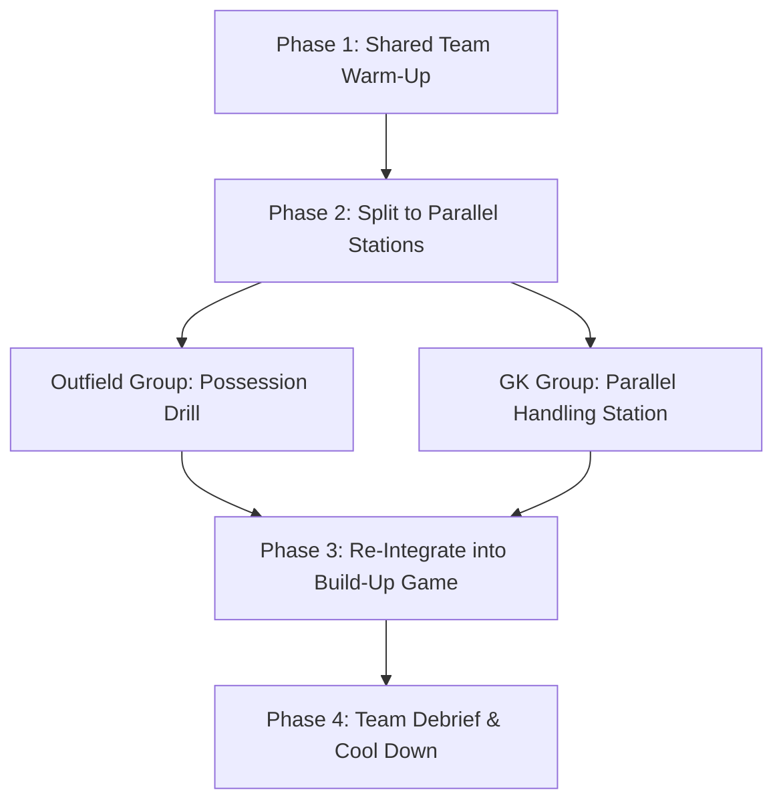

import { Card, CardGrid, Aside, Steps } from '@astrojs/starlight/components';

Plan a goalkeeper-friendly practice in under five minutes. This repeatable session skeleton integrates goalkeepers into standard team training without requiring a dedicated goalkeeper coach or specialized equipment.

<Aside type="tip" title="The Sideline Rule">
Never run a session where the goalkeeper stands alone in goal while outfield players take turns shooting from 20 yards away. Keepers must move, handle, and distribute continuously throughout every phase of practice.
</Aside>

---

## Age-Appropriate Session Frameworks

Adjust your total training duration and block breakdown based on physical development and attention spans.

<CardGrid grid={2}>
  <Card title="Grassroots (U6–U8) → 45 Minutes" icon="star">
    * **10 min:** Integrated Warm-Up & Tag Games
    * **10 min:** Parallel Handling Circuit (Foam Balls)
    * **20 min:** 4v4 Small-Sided Game (Rotating Keepers)
    * **5 min:** Wrap-Up & Highlight Recap
  </Card>

  <Card title="Development (U9–U12) → 60 Minutes" icon="compass">
    * **10 min:** Team Dynamic Warm-Up & Footwork
    * **15 min:** Technical Station (Handling & Angles)
    * **30 min:** Build-Up Restart Game (Plus-One Rule)
    * **5 min:** Debrief & Psychological Reset
  </Card>

  <Card title="Youth Elite (U13+) → 75 Minutes" icon="rocket">
    * **15 min:** Athletic Warm-Up & Dynamic Set Position
    * **20 min:** High-Repetition Shot Stopping & Crosses
    * **35 min:** 9v9 / 11v11 Game Realism & Pressing
    * **5 min:** Cool Down & Performance Review
  </Card>

  <Card title="The 5-Minute Wrap-Up" icon="shield">
    * End every session by highlighting **one great save** or **one courageous decision** made by each goalkeeper.
    * Conclude on a high note to build long-term retention and confidence.
  </Card>
</CardGrid>

---

## Master Equipment Bag Checklist

Pack your coaching bag with age-matched equipment to ensure safety and technical skill development.

<Aside type="caution" title="Glove Selection Warning for Youth">
Avoid stiff "finger-save" (plastic spine) gloves for players under age 12. They restrict hand flexibility, reduce ball feel, and prevent players from developing natural finger strength for the W-catch.
</Aside>

| Equipment Item | Grassroots (U6–U8) | Development (U9–U12) | Youth Elite (U13+) |
| :--- | :--- | :--- | :--- |
| **Match Balls** | Size 3 (or foam/lightweight) | Size 4 | Size 5 |
| **Goal Types** | 6 × 4 ft Pop-Up Goals | 18 × 6.5 ft Frame Goals | 24 × 8 ft Regulation Goals |
| **Gloves** | Optional (Bare hands/Soft Latex) | Soft Latex Palm (No Spines) | Match-Grade Latex |
| **Cones** | 12 Tall Cones + 20 Flat Discs | 12 Tall Cones + 20 Flat Discs | 12 Tall Cones + 20 Flat Discs |
| **Pinnies/Bibs** | 2 Distinct Colors | 2 Distinct Colors | 3 Distinct Colors |

---

## Chronological Session Flow

Follow this 4-step sequence to run a seamless 60-minute training session.

<Steps>
1. **Team Warm-Up (10 Mins):** Include goalkeepers in all outfield agility drills, tag games, and dynamic stretching to build general athleticism.

2. **Parallel Skill Station (15 Mins):** Run a 10 × 10 yd station alongside the main pitch focusing on handling (W-catch, low scoop) and set position mechanics.

3. **Integrated Team Game (30 Mins):** Run a small-sided game where **every restart originates from the goalkeeper's hands or feet**.

4. **Cool-Down & Positive Recap (5 Mins):** Gather the team, reinforce key communication calls, and celebrate standout goalkeeper actions.
</Steps>

---

## Printable 1-Page Coaching Cue Matrix

Keep this reference matrix on your clipboard for rapid, on-the-fly corrections during live play.

| Category | Common Technical Error | Corrective Body Mechanic | 3-Word Coaching Cue |
| :--- | :--- | :--- | :--- |
| **High Handling** | Ball slips through hands on chest-high shots | Form an overlapping W-shape with thumbs and index fingers | **"Make the W!"** |
| **Ground Handling** | Bobbling low rolling shots into the net | Bring pinkies together to form a secure scoop basket | **"Pinkies together!"** |
| **Set Position** | Moving or shuffling while the shooter strikes | Freeze feet on the ground the instant leg swings | **"Freeze on kick!"** |
| **Stance Balance** | Standing flat-footed with heels planted on the line | Shift weight forward onto the balls of the feet | **"Weight on toes!"** |
| **Distribution** | Passing straight down the middle into pressure | Open hips to angle the pass toward the touchline | **"Open to side!"** |
| **Psychological** | Dwelling on a conceded goal with slumped shoulders | Retrieve ball, breathe, and touch goalposts to reset | **"Fresh clock, set!"** |

---

## Field Setup Architecture

